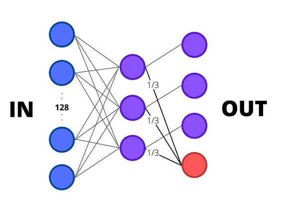
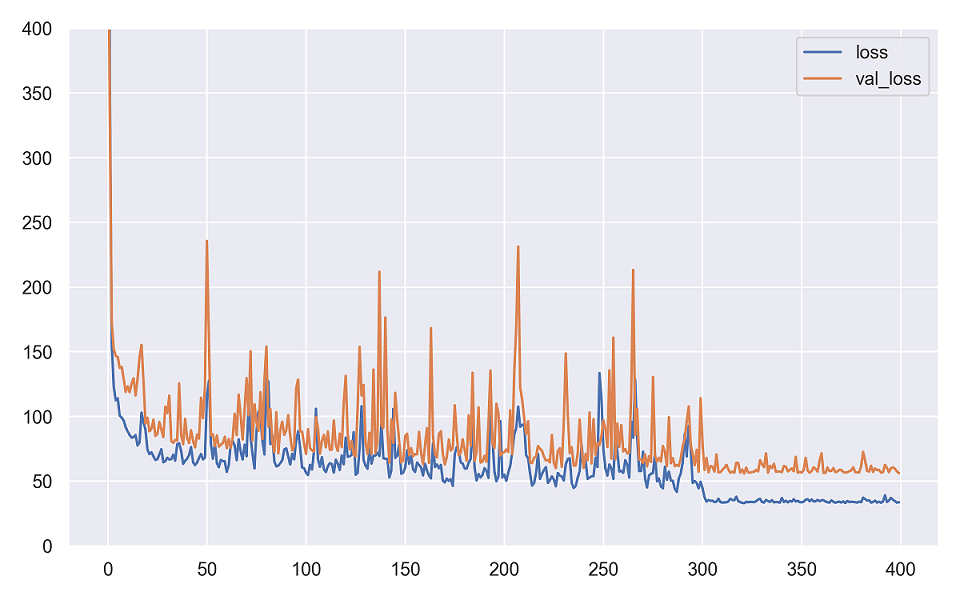
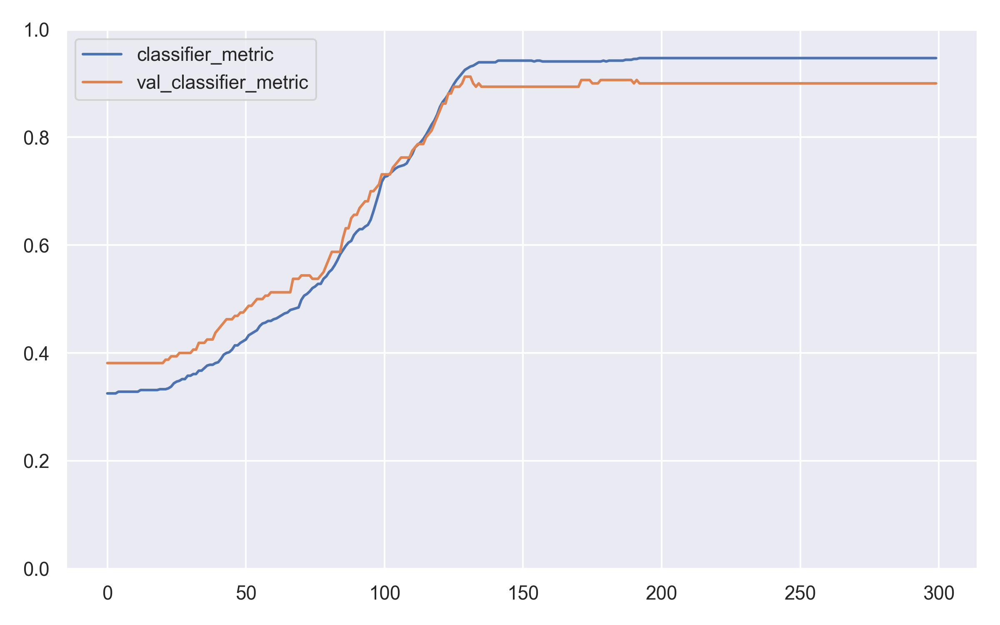
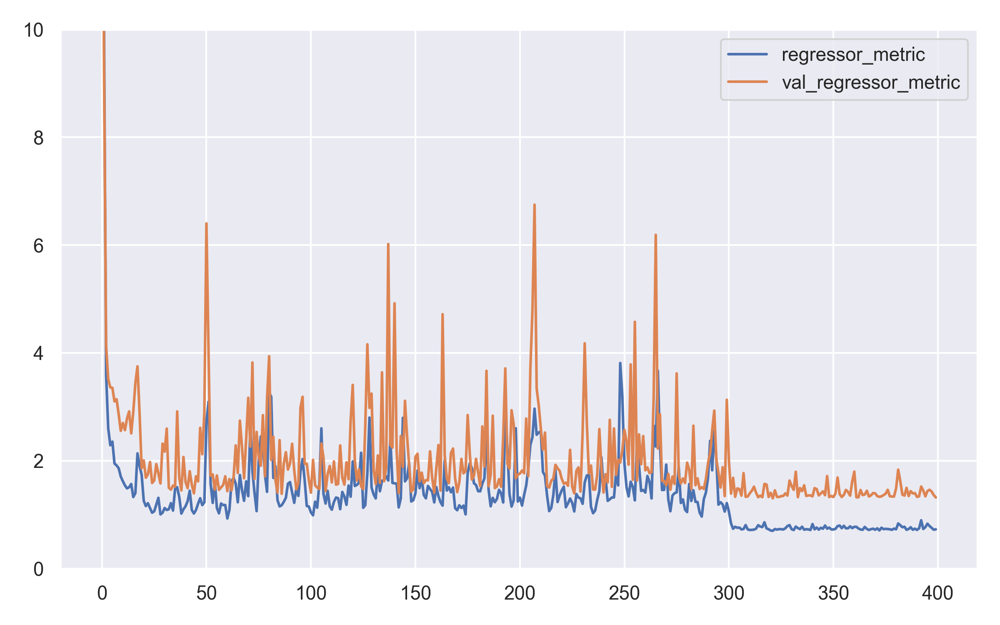

# ML on phrases
Task text:
> Однажды разработчики технологий анализа голоса решили заняться классификацией эмоций (счастье, грусть, злость) и определением возраста говорящего. У них уже есть технология, позволяющая получать из произношения фраз вектора размерностью 128, которые хотелось бы использовать для данной задачи, но так как задачу определения одной из трех эмоции и возраста придется решать на микронаноустройстве, было решено сделать очень серьезные ограничения:
> 1. Модель должна представлять собой одну матрицу размерности 128x4. При умножении вектора на эту матрицу, мы получаем 4 числа:
> * Первые 3 числа относятся к классификатору эмоций (наибольшее из трех чисел определяет класс эмоции);
> * Последнее четвертое число предсказывает возраст говорящего.
> 
> 2. Чтобы сэкономить память на устройстве, было решено объединить веса классификатора и регрессионной модели следующим образом:
> * Последняя четвертая колонка матрицы, предсказывающая возраст, получается путем линейной комбинации первых трех колонок.
> * Коэффициенты линейной комбинации должны быть неотрицательны и суммироваться в единицу.
> 
> При этом необходимо, чтобы поддерживалось определенное качество модели:
> * Требования к качеству классификатора: средняя точность не менее 90%.
> * Требования к качеству регрессора: средняя ошибка MSE не более 2.0.
> 
> В качестве ответа вам нужно послать JSON-файл с двумя тензорами в виде Python-списков: matrix - матрица размера 128x3, которая будет отвечать за классификацию данных, и coefficients - вектор размера 3, который содержит коэффициенты для колонок из матрицы matrix, чтобы получить регрессор.
> 
> Данные для обучения:
> 1. X.npy (матрица размера 800∗128800∗128) - вектора произношения фраз;
> 2. Y1.npy (вектор длины 800800) - классы эмоций фраз (3 класса: {0, 1, 2});
> 3. Y2.npy (вектор длины 800800) - возраст говорящего (целое число от 6 до 65).

# Results
In accordance with the statement of work, 
the ANN shown in the figure below was developed.

The three output neurons indicated in **purple** 
are the outputs of the classifier 
and the output indicated in **red** 
is the output of the regressor.

To get the weights of the classifier, 
a single-layer perceptron was trained. 
To simplify the solution, 
the regressor weights were taken as constants equal to **1/3**.

The sum of the classifier's MSE 
and the regressor's MSE was used as the loss function.

The course of training is illustrated by the following three figures.

The results of the work are placed in the **results.json** file 
of the root directory in the format specified by the statement of work.
