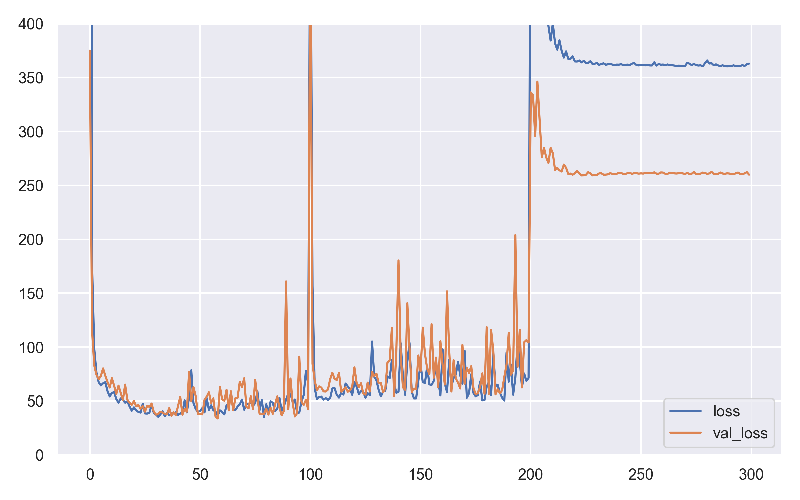
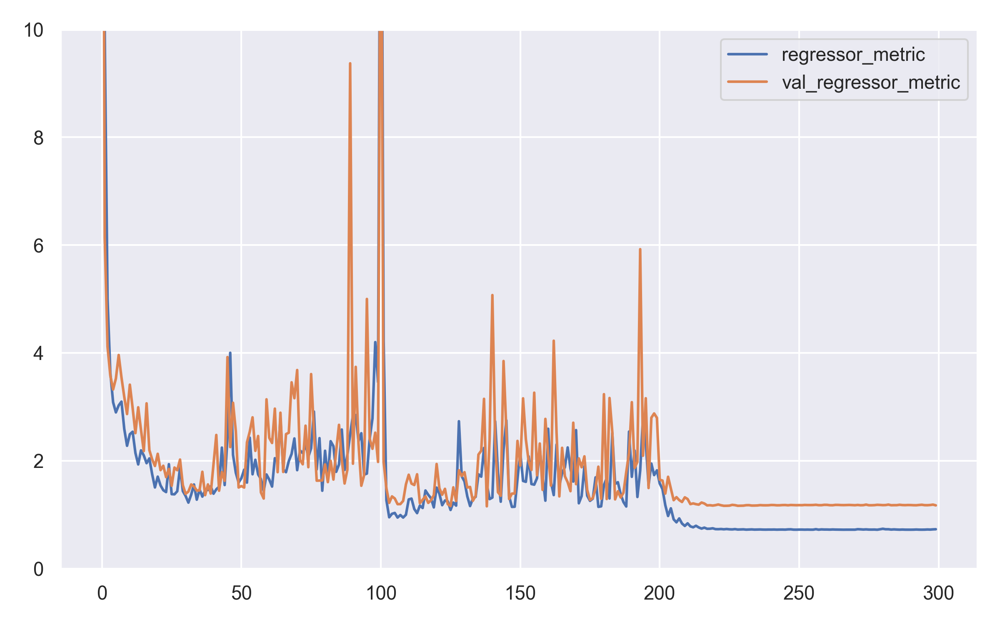

# ML on phrases
 Task from the interview.

# Results
In accordance with the statement of work, 
the ANN shown in the figure below was developed.

The three output neurons indicated in **purple** 
are the outputs of the classifier 
and the output indicated in **red** 
is the output of the regressor.

To get the weights of the classifier, 
a single-layer perceptron was trained. 
To simplify the solution, 
the regressor weights were taken as constants equal to **1/3**.

The sum of the classifier's MSE 
and the regressor's MSE was used as the loss function.

The course of training is illustrated by the following three figures.

The results of the work are placed in the **results.json** file 
of the root directory in the format specified by the statement of work.
